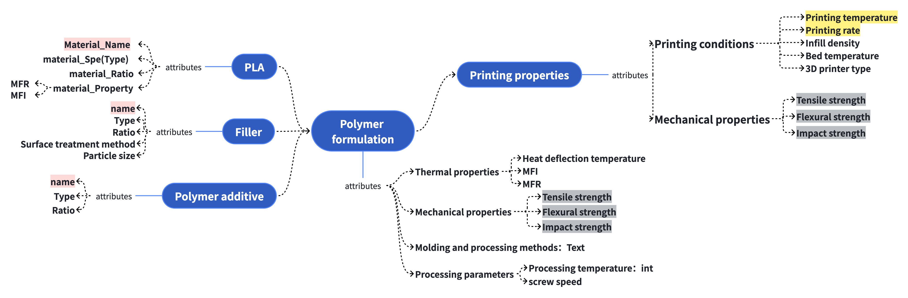

# 配方数据抽取逻辑

这是抽取的schema


> 基于 `prompts.py,pla_extract.py` 文件的抽取流程梳理

---

## 📋 概述

本系统使用 **三步式抽取流程** 从科学文献中提取聚合物配方和加工工艺数据。每个步骤都使用特定的 Prompt 模板引导大语言模型 (LLM) 进行结构化数据抽取。

---

## 🔄 抽取流程总览

```
┌─────────────────────┐
│    原始文献文本       │
└──────────┬──────────┘
           │
           ▼
┌─────────────────────┐
│  Step 1: 抽取       │  MAJOR_POLYMER_EXTRACTION
│  提取配方基础信息     │
└──────────┬──────────┘
           │
           ▼
┌─────────────────────┐
│  Step 2: 验证    │  MAJOR_POLYMER_EXTRACTION_REFINEMENT
│  过滤和校验数据      │
└──────────┬──────────┘
           │
           ▼
┌─────────────────────┐
│  Step 3:          │  PRINTING_OPTIMIZATION_EXTRACTION
│  提取工艺优化实验数据    │
└──────────┬──────────┘
           │
           ▼
┌─────────────────────┐
│  最终结构化JSON      │
└─────────────────────┘
```

---

## 📝 Step 1: 主抽取 (`MAJOR_POLYMER_EXTRACTION`)

### 目标
从文献中提取聚合物配方的基础信息，包括材料组成、加工方法和性能数据。

### 输出数据结构

#### PolymerStudy (根对象)
| 字段 | 类型 | 说明 |
|------|------|------|
| `isPolymerStudy` | boolean | 是否为聚合物研究论文 |
| `numFormulations` | number | 提取的配方数量 (最多5个) |
| `formulations` | Formulation[] | 配方列表 |

#### Formulation (配方)
| 字段 | 类型 | 说明 |
|------|------|------|
| `id` | number | 配方编号 |
| `description` | string | 配方简述，如 "PLA/CNT composite with 5 wt% loading" |
| `polymerMatrix` | object | 聚合物基体信息 |
| `fillers` | Filler[] | 填料列表 |
| `additives` | Additive[] | 添加剂列表 |
| `processing` | object | 加工方法和参数 |
| `properties` | object | 力学和热学性能 |

#### polymerMatrix (聚合物基体)
| 字段 | 类型 | 示例 |
|------|------|------|
| `materialName` | string | "PLA", "ABS" |
| `materialType` | string | "NatureWorks 4043D" |
| `ratio` | string | "90 wt%", "80%" |
| `properties.MFR` | string \| null | 熔体流动速率 |
| `properties.MFI` | string \| null | 熔体流动指数 |

#### Filler (填料)
| 字段 | 类型 | 说明 |
|------|------|------|
| `name` | string | 填料名称，如 "Carbon Fiber" |
| `type` | string | 具体型号或形态 |
| `ratio` | string | 添加比例，如 "5 wt%" |
| `surfaceTreatment` | string \| null | 表面处理，如 "Silane coupling agent" |
| `particleSize` | string \| null | 粒径（纳米/微米）或层数（2D材料） |

#### Additive (添加剂)
| 字段 | 类型 | 说明 |
|------|------|------|
| `name` | string | 添加剂名称，如 "Plasticizer" |
| `type` | string | 具体类型 |
| `ratio` | string | 添加比例 |

#### Processing (加工信息)
| 字段 | 类型 | 说明 |
|------|------|------|
| `method` | string | 加工方法，如 "FDM 3D Printing", "Injection Molding" |
| `parameters.processingTemperature` | number \| null | 加工温度 (°C) |
| `parameters.screwSpeed` | string \| null | 螺杆转速，如 "50 rpm" |

#### Properties (性能数据)
| 分类 | 字段 | 说明 |
|------|------|------|
| **力学性能** | `tensileStrength` | 拉伸强度 (MPa) |
| | `flexuralStrength` | 弯曲强度 (MPa) |
| | `impactStrength` | 冲击强度 |
| **热学性能** | `heatDeflectionTemperature` | 热变形温度 |
| | `MFI` | 熔体流动指数 |
| | `MFR` | 熔体流动速率 |

### 关键抽取规则

1. **相关性检查**
   - 仅抽取聚合物制备、加工或实验表征相关论文
   - 忽略纯单体合成或理论模拟 (DFT/MD) 论文

2. **核心数据原则**
   - 不抽取所有配方，仅提取：
     - 最具代表性的基线配方
     - 组成上最优的配方

3. **完整性要求**
   - 必须包含：聚合物基体名称 + 至少一个力学/热学性能数值 + 基本加工方法

4. **As-Printed 原则** ⚠️ **关键**
   - 只提取使用固定/默认参数打印的样品性能
   - **不使用** 工艺参数优化后的数据

---

## 🔍 Step 2: 精炼验证 (`MAJOR_POLYMER_EXTRACTION_REFINEMENT`)

### 目标
对 Step 1 的抽取结果进行验证、过滤和清洗，确保数据质量。

### 精炼规则

#### 1. 相关性验证
如果论文不是真正的聚合物实验研究，设置：
```json
{
  "isPolymerStudy": false,
  "numFormulations": 0,
  "formulations": []
}
```

**不属于聚合物研究的情况：**
- 无实验性聚合物制备/表征
- 仅关注单体合成、模拟、建模或打印机设计
- 摘要/标题/结论未确认实验性聚合物性能数据

#### 2. 配方筛选
| 保留 | 移除 |
|------|------|
| 代表性/基线配方 | 中间试验配方 |
| 组成上最优配方 | 比例扫描中的配方 |
| | 仅在工艺优化后报告性能的配方 |
| | 仅有微小比例变化的冗余配方 |

- **最多保留：5个配方**
- **最少保留：0个配方**

#### 3. As-Processed 约束
- 仅包含 as-printed / as-extruded / as-molded 样品的性能
- 移除系统性参数优化后测量的配方
- 若同时存在优化和非优化数据，选择 **非优化数据**

#### 4. 组成准确性
| 要素 | 规则 |
|------|------|
| 聚合物基体 | 必须明确命名，不推断牌号/结晶度 |
| 填料 | 必须明确提及，不从 "增强" 等模糊词推断 |
| 添加剂 | 仅包含明确声明的增塑剂、稳定剂、相容剂、抗氧剂 |

#### 5. 性能验证
- 至少需要一个数值型性能数据：
  - 力学：拉伸强度、弯曲强度、冲击强度
  - 或热学：热变形温度、MFI、MFR
- 移除仅有定性描述或图示说明的配方

#### 6. 一致性检查
- `numFormulations` = 保留的配方数量
- `id` 从 1 开始顺序编号
- 保留 Step 1 的所有原始字段

---

## ⚙️ Step 3: 工艺优化抽取 (`PRINTING_OPTIMIZATION_EXTRACTION`)

### 目标
为每个配方提取 **打印/加工工艺优化实验** 数据，包括参数变化和对应的力学性能变化。

### 新增数据结构

#### optimizationData (优化数据集)
| 字段 | 类型 | 说明 |
|------|------|------|
| `studyDescription` | string | 研究简述，如 "Effect of nozzle temperature on tensile strength" |
| `constantParameters` | object | 恒定参数 |
| `dataPoints` | OptimizationRun[] | 实验数据点列表 |

#### constantParameters (恒定参数)
| 字段 | 示例 |
|------|------|
| `printerType` | "Prusa i3 MK3" |
| `nozzleDiameter` | "0.4 mm" |
| `layerHeight` | "0.2 mm" |
| `infillPattern` | "Rectilinear" |

#### OptimizationRun (单次实验)
| 字段 | 类型 | 说明 |
|------|------|------|
| `conditions` | object | 实验条件 |
| `properties` | object | 对应的力学性能 |

#### conditions (实验条件)
| 字段 | 示例 |
|------|------|
| `printingTemperature` | "190 °C" |
| `printingSpeed` | "40 mm/s" |
| `bedTemperature` | "60 °C" |
| `infillDensity` | "100%" |

#### 方向相关的力学性能
每个力学性能都需要区分方向：
| 字段 | 说明 |
|------|------|
| `xyAxis` | XY 轴方向性能值 |
| `zAxis` | Z 轴方向性能值 |
| `fractureSurfaceMorphology` | 断裂面形貌描述 |

### 抽取规则

1. **代表性优先**：仅提取代表性优化实验，每个优化研究最多 5 个数据点
2. **系统变化**：仅包含打印/加工参数被系统性变化的实验
3. **保留原始信息**：附加优化数据，不修改原始配方信息
4. **单位保持**：保留原始报告的单位 (MPa, °C, mm/s, %)
5. **方向区分**：分别提取 XY 轴和 Z 轴的性能值
6. **形貌描述**：简短定性描述断裂面形貌

---

## 📄 Step 4: 优化精炼 (`PRINTING_OPTIMIZATION_EXTRACTION_REFINED`)

### 目标
基于文献文本，验证和补全 JSON 数据中的配方信息、打印参数和材料性能。

### 功能
- 验证现有 JSON 条目的正确性
- 补全缺失、空白或标记为未知的值
- 使用文献原文信息进行准确补全

---

## 📊 数据流示意

```
文献原文
    │
    ├── Step 1: 初步抽取
    │   ├── 材料组成 (基体 + 填料 + 添加剂)
    │   ├── 加工方法和参数
    │   └── 力学/热学性能
    │
    ├── Step 2: 验证精炼
    │   ├── 过滤非聚合物研究
    │   ├── 筛选代表性配方
    │   └── 验证数据完整性
    │
    └── Step 3: 优化数据
        ├── 打印参数变化实验
        ├── 多方向力学性能
        └── 断裂形貌分析
```

---

## ⚠️ 重要注意事项

### As-Printed 原则

> **核心规则**：所有提取的性能数据必须来自使用固定/默认参数打印的样品，而非工艺优化后的结果。

#### 适用范围

**As-Printed 原则仅适用于 Step 1 和 Step 2，不适用于 Step 3。**

| 抽取步骤 | As-Printed 原则 | 说明 |
|---------|:---------------:|------|
| **Step 1: 主抽取** | ✅ 适用 | 只提取使用固定/默认参数打印的样品的基线性能 |
| **Step 2: 精炼验证** | ✅ 适用 | 验证并过滤掉工艺优化后的数据，若同时存在优化和非优化数据，选择非优化数据 |
| **Step 3: 优化抽取** | ❌ 不适用 | 专门提取工艺参数优化实验数据（温度、速度、填充率等变化实验） |

#### 设计逻辑

```
Step 1/2: 建立配方的【基线性能】(As-Printed)
     │
     └──→ Step 3: 附加【工艺优化实验数据】
              │
              └──→ 完整的数据集 = 基线 + 优化变化
```

- **Step 1 & 2** 的目标是获取配方在**标准/默认条件**下的性能表现，作为对比基准
- **Step 3** 的目标是记录**参数变化如何影响性能**，需要提取优化实验的全部数据点

### 数据完整性
> 每个有效配方必须包含：
> - 聚合物基体名称
> - 至少一个数值型性能数据
> - 基本加工方法信息

### 配方数量限制
> 每篇论文最多提取 **5 个** 代表性配方，避免提取所有试验变体。

---

## 📁 文件信息

| 属性 | 值 |
|------|------|
| **源文件** | `prompts.py` |
| **Prompt 数量** | 4 个 |
| **主要语言** | TypeScript 接口定义 (用于结构化输出) |
| **输出格式** | JSON |

---

*文档生成时间: 2026-01-13*
