# Effect of Infill Density and Printing Patterns on Compressive Strength of ABS, PLA, PLA-CF Materials for FDM 3D Printing

Thanh-Dung Do $^{1,a}$ , Manh-Cuong LE $^{1,b}$ , Tuan-Anh NGUYEN $^{2,c}$  and Thai-Hung LE $^{1,d*}$

$^{1}$ School of Materials Science and Engineering, Hanoi University of Science and Technology (HUST), Hanoi, Vietnam

2Vietnam Standards and Quality Institute, (VSQI), Hanoi, Vietnam

$^{a}$ dung.dothanh@hust.edu.vn,  $^{b}$ cuong.lm167090@sis.hust.edu.vn,  $^{c}$ anhnt.vsqi@gmail.com,  $^{d}$ hung.lethai@hust.edu.vn

Keywords: 3D printing, FDM, ABS, PLA, PLA-CF, printing patterns, infill density, compressive strength.

Abstract. Fused Deposition Modeling (FDM) 3D printing is one of the most popular 3D printing technology today and its products is always interested to improving their mechanical properties by printed engineering parameters. In this study, the influences of infill density and printing pattern on mechanical properties of FDM 3D printing structure have been studied on some common printing materials including Acrylonitrile Butadiene Styrene (ABS), Polylactic Acid (PLA), carbon fibre reinforced PLA composites (PLA-CF). Each material is printed with different patterns such as hexagonal, square, triangular, zigzag structures at  $15\%$  infill. Particularly for the triangle printed structure of ABS, there are three infill densities at  $15\%$ ,  $25\%$  and  $40\%$ . The experimental process has evaluated the strength and deformation of the printing patterns. The results have shown that the influence of printing patterns on compressive strength are significant because of the relationship between printing patterns and sample weight. Besides, infill density also have a great influence on the compressive strength of 3D printed products.

# Introduction

Additive Manufacturing technology (AM) has been widely and rapidly developed with a variety of printing methods and print materials applied in manufacturing [1]. The AM technology is divided into many technologies such as FDM (Fused Deposition Modeling), LOM (Laminated Object Manufacturing), SLS (Selective Laser Sintering), SLA (Stereolithography)... and FDM technology is one of the popular technologies among them because of its manufacturing cost and the use of commonly and inexpensively materials. The FDM's products are widely applied in many fields such as biomedical applications, electronic and functional applications, tooling applications and aerospace applications [2]. Naturally, the quality of FDM products also depends on different technological parameters [3-8]. These parameters directly affect the product quality such as surface roughness [3, 9, 10], mechanical properties [4-6].

The strength of FDM 3D printed products is mainly studied to improve by improving the strength of the printed material or optimizing the printing technology parameters because the mechanical properties of the 3D printed structure may depend on the structure parameters rather than material properties. To improve the strength of the printed material, reinforcing phases such as carbon fiber [11-13] or natural fibers such as poplar fiber [14] are added to incorporate into better composites. Besides, many studies have focused on clarifying the influence of printing parameters such as printing pattern [3, 6, 12], infill density [4-6, 12], printing temperature and print speed [6] ... to the strength of the printed structure. The commonly printing patterns are hexagonal, square, triangular and they are printed with various densities to clarify their mechanical properties, the relationship between strength and printing pattern, infill density. Almost authors mainly [3-6] used tensile tests to find the relationship between strength, structure and density. The results indicate that as the tensile strength increases when the infill density grows and when direction of pattern fabric is

close to the load direction. However, the influence of printing parameters on strength of completed product quality is not clear [7, 8]. The relationship between printing parameters and printed compression strength has also been shown that the compressive strength of ABS printed structures is related to the printing direction [15], the printing layer thickness [16] printing pattern and infill density [17, 18]. Therefore, the objective of this work was conducted with the goal of clarifying the influence of printing patterns, infill density on compressive strength of 3D printing products made by ABS, PLA, and carbon fiber reinforced PLA-CF. Thus, the suitable printing parameters can be chosen and applied to appropriate the requirements specification.

# Materials and Experimental Procedures

There were three types of chosen materials supplied by Flashforge USA, Inc. They were acrylonitrin butadien styren (ABS), polylactic acid (PLA) and PLA reinforced with  $15\mathrm{wt}.\%$  very short carbon fibers (PLA-CF). All the samples were printed by 3D ANYCUBIC printer with the same printing speed but different temperatures to achieve the accuracy and the smooth surface (printing parameters is shown in table 1).

<table><tr><td>Materials</td><td>ABS</td><td>PLA</td><td>PLA-CF</td></tr><tr><td>Print temperature (°C)</td><td>230</td><td>195</td><td>195</td></tr><tr><td>Temperature of print bed (°C)</td><td>90</td><td>60</td><td>60</td></tr><tr><td>Print speed (mm/s)</td><td>30</td><td>30</td><td>30</td></tr><tr><td>Print layer thickness (mm)</td><td>0.2</td><td>0.2</td><td>0.2</td></tr><tr><td>Print orientation (°)</td><td>[0-90]</td><td>[0-90]</td><td>[0-90]</td></tr><tr><td>Printer nozzle diameter (mm)</td><td>0.4</td><td>0.4</td><td>0.4</td></tr><tr><td>Print condition</td><td colspan="3">Print in a closed cabin</td></tr></table>

Table 1. Printing parameters of ABS, PLA and PLA-CF

Compression samples were printed by 3D ANYCUBIC printer with the same dimension and  $15\%$  infill density but different print patterns. Their sizes are  $20~\mathrm{mm}$  long,  $20~\mathrm{mm}$  wide and  $30~\mathrm{mm}$  high. Their print patterns were hexagon, square, triangle, zigzag (figure 1.a) with different print time (see table 2). The structures having triangle pattern were printed in three infill densities (figure 1.b):  $15\%$ ,  $25\%$  and  $40\%$ , respectively. ABS printed samples at  $15\%$  infill density were weighed to determine the density of each pattern printed structure by analytical balance which have a readout accuracy to 0.01 gram. These measured weights of triangular pattern structure are listed in table 2.

Table 2. Print time and weight of ABS printed samples at  $15\%$  infill with different printing patterns  

<table><tr><td>Patterns</td><td>Hexagon</td><td>Square</td><td>Triangle</td><td>Zigzag</td></tr><tr><td>Print time (minute)</td><td>63</td><td>69</td><td>61</td><td>50</td></tr><tr><td>Weight (gram)</td><td>1.76</td><td>2.47</td><td>1.66</td><td>1.41</td></tr></table>

Compression samples were examined by compression testing to evaluate peak force and failure behavior of the specimens. The compression was performed by INSTRON 5582 testing machine with a  $10\mathrm{kN}$  capacity and displacement controlled (figure 2). Compressive loading was increased along the sample height at a displacement speed of  $5\mathrm{mm / min}$ . The failure samples are shown in figure 3 and figure 4. The compression results are illustrated as force and displacement curve in figure 5.

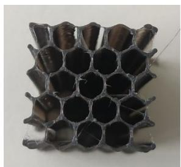  
Hexagon

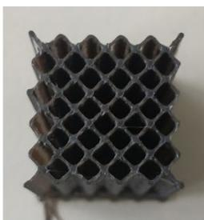  
Square

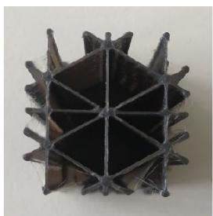  
Triangle

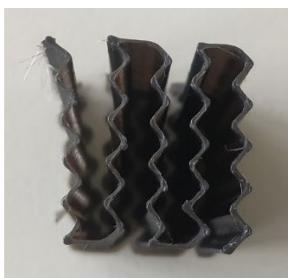  
Zigzag

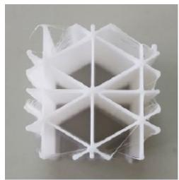  
15% infill

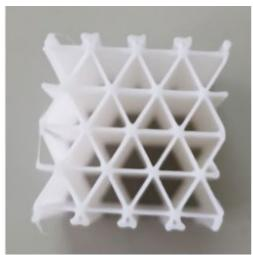  
a.  
25% infill  
b.

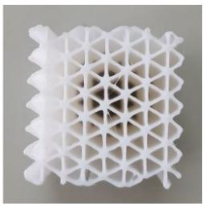  
40% infill

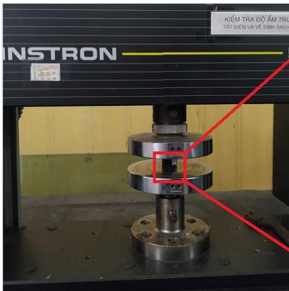  
Figure 1. Printing structure of ABS, PLA and PLA-CF; a. Structure with different print patterns: hexagon, square, triangle, zigzag with  $15\%$  infill; b. triangle pattern structure with different infill densities  $15\%$ ,  $25\%$  and  $40\%$  
Figure 2. Experimental setup of compression test

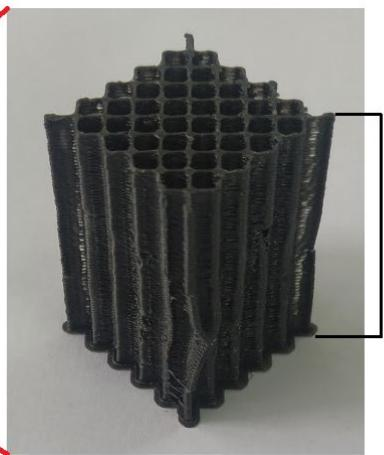  
H

# Results and Discussions

The curves in the figure 5 show that all the structures have linear elastic behavior at the beginning and then non-linear viscosity behavior, especially the square pattern structure of PLA and PLA-CF. When the force reaches the highest values, these curves decrease sharply except the triangle pattern reducing slowly. The reason of gradually reduction is because the triangle structure has six edges at each vertex that increases structural resistance following compression direction, while the square and hexagonal structure has 4 edges at each vertex. When the pressure increases, each edge of the internal structure of triangle pattern samples is broken one by one until the stress reaches the plastic deformation limit due to stress concentration.

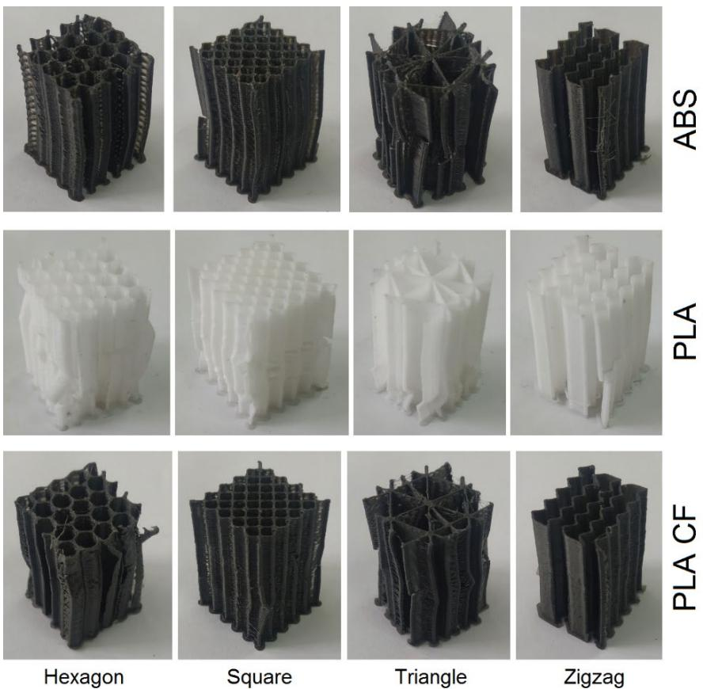  
Figure 3. Printing structures with different printing patterns after compression test: hexagon, square, triangle, zigzag in  $15\%$  infill; a. ABS; b. PLA; c. PLA-CF.

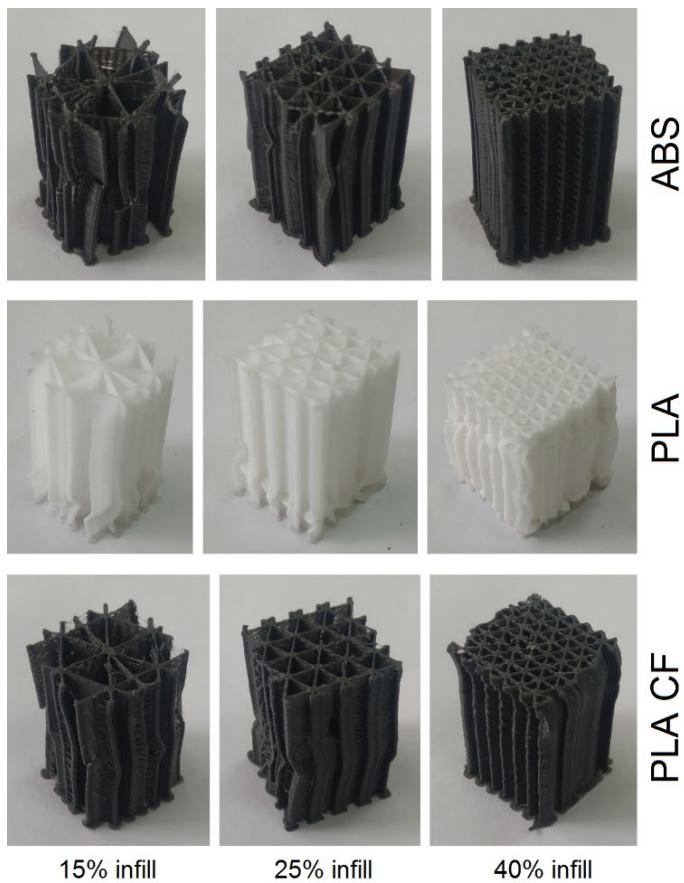  
Figure 4. Printing structures with different infill density after compression test;  $15\%$ ,  $25\%$  and  $40\%$ ; a. ABS; b. PLA; c. PLA-CF.

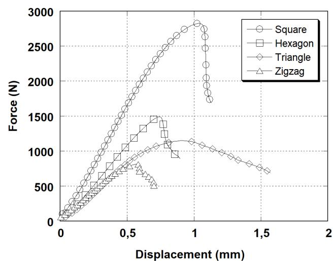  
a. ABS

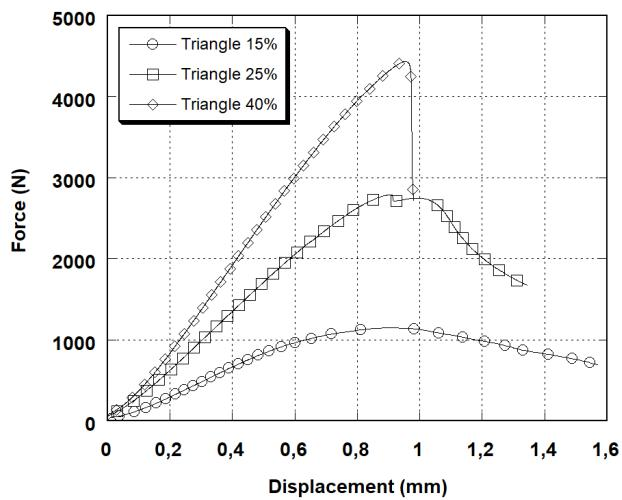

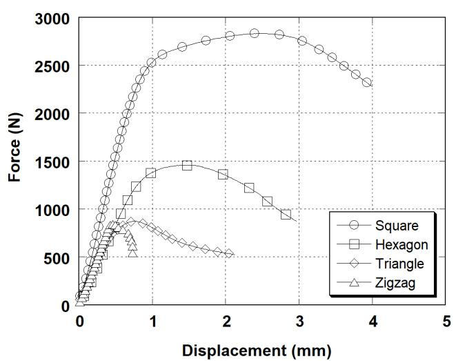  
b. PLA

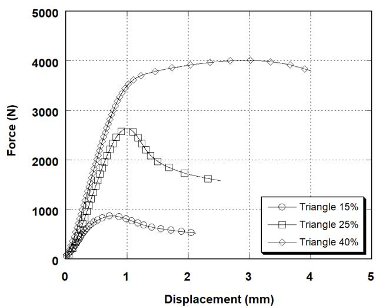

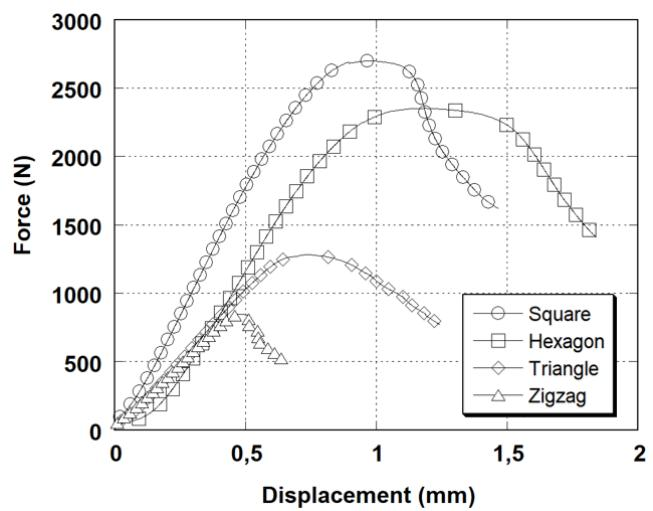  
c. PLA-CF

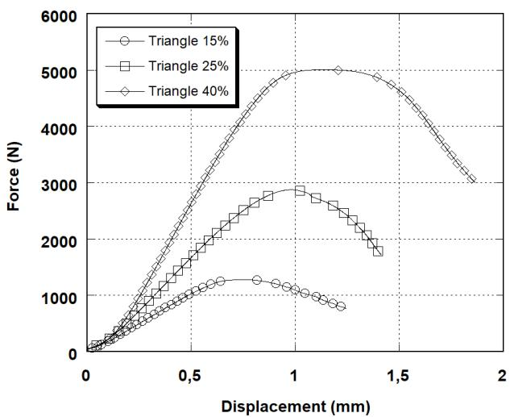  
Figure 5. Force and displacement curves of samples with different printing patterns and different infill densities of ABS (a), PLA (b) and PLA-CF (c)

In general, the compressive strength of structural samples with zigzag, triangle and hexagon pattern are gradually increasing respectively but rise suddenly with square pattern structure. For ABS and PLA CF materials, the maximum compression force value of the square structure is almost twice as high as that of the honeycomb sample having the second value of compression

ultimate force and is three times than that of the zigzag pattern with the lowest ultimate force value (see table 3). These large distances on graphs show that the compressive strength of the square structure is the most optimal among the four types of printing patterns. The zigzag pattern structure has a lowest compressive strength because this structure has a lack of cross-links so it is easy to be bended following the compression direction. The displacement of the samples is mostly proportional increase to the strength except for the ABS triangle and PLA-CF square samples.

Table 3. Maximum compression force of printed structures with different printing patterns and different infill densities  

<table><tr><td rowspan="2">Printing patterns</td><td colspan="3">Compressive force (N)</td></tr><tr><td>ABS</td><td>PLA</td><td>PLA-CF</td></tr><tr><td>Hexagon (15 %)</td><td>1490</td><td>1456</td><td>2353</td></tr><tr><td>Square (15 %)</td><td>2824</td><td>2831</td><td>2697</td></tr><tr><td>Zigzag (15 %)</td><td>813</td><td>860</td><td>845</td></tr><tr><td>Triangle (15 %)</td><td>1150</td><td>873</td><td>1282</td></tr><tr><td>Triangle (25 %)</td><td>2788</td><td>2632</td><td>2875</td></tr><tr><td>Triangle (40 %)</td><td>4434</td><td>4014</td><td>5011</td></tr></table>

The results on the graph also show that the strength of printed products between the two materials PLA and ABS is quite equivalent, for example: the compressive strength of PLA square structure is  $2831\mathrm{N}$ , it is approximately the value  $2824\mathrm{N}$  of the same type ABS specimen. For hexagon and zigzag structures, compression force values are  $1490\mathrm{N}$ ,  $860\mathrm{N}$  and  $1456\mathrm{N}$ ,  $813\mathrm{N}$  for PLA and ABS materials respectively. The only structure with a difference in compressive strength is the triangular pattern, the compression force of PLA sample is  $873\mathrm{N}$ ,  $31.72\%$  smaller than that of ABS specimen.

The compressive strength of PLA-CF pattern is generally not significantly changed compared to other materials but particularly high in the case of hexagonal pattern printing, the measured compressive force value of PLA-CF is  $2353\mathrm{N}$ , much higher than the same type values of ABS of  $1490\mathrm{N}$  and PLA of  $1456\mathrm{N}$ . This shows that the honeycomb structure will have a significant strength improvement when the material is improved to higher strength.

The displacements of the samples are generally increasing in order of structure and material: zigzag, triangular, hexagonal, square and ABS, PLA, PLA-CF, respectively. The samples printed from ABS material have a lowest displacement value of about  $1\mathrm{mm}$  upon failure, the maximum measured displacement value which is about  $1.5\mathrm{mm}$  is belongs to the triangular printing patterns. Patterns printed with PLA material have a higher displacement value and a clear differentiation between structures. The zigzag structures have the lowest displacement values which are between  $0.5\div 1\mathrm{mm}$  for both ABS and PLA-CF materials. Meanwhile, the square and hexagonal pattern structures have significant improvements in displacement which increase of about  $1.5\div 2\mathrm{mm}$  compared to the value about  $1\mathrm{mm}$  with the ABS printing patterns. PLA printed samples show the largest displacement value, in particularly with square and hexagonal structures whose values are three times higher than that of ABS plastic and almost twice than that of PLA-CF material. Displacement values of the triangle samples have a difference of about  $1\mathrm{mm}$  with all 3 printed materials, which indicates that the triangular structure has strain stability and has less dependent on the material properties.

The triangular printed structure has a different deformation behavior from the others of the printed samples in the compression test, so it was selected to test the effect of infill density on the compressive strength of the printed structure. The graphs show that the compressive strength increases proportionally with the increase of infill density and the deformation except samples printed from ABS material. However, the downward slope of the ending graph sections increases

proportionally to the infill density also shows that the structural destruction rate after plastic deformation increases gradually with increasing of infill density. The reason of increase of the destruction rate of the triangle printing pattern structure is because triangle bonds become stronger when the infill density increases. The increased strength of bonds lead to distribution of equally load on them causing simultaneous destruction of many triangle links instead of destroying them one by one. The reason of decrease of the displacement speed of the ABS triangle printing pattern is relating to the materials properties which reveal in the force and displacement curves that the compression force grows when the displacement reduces.

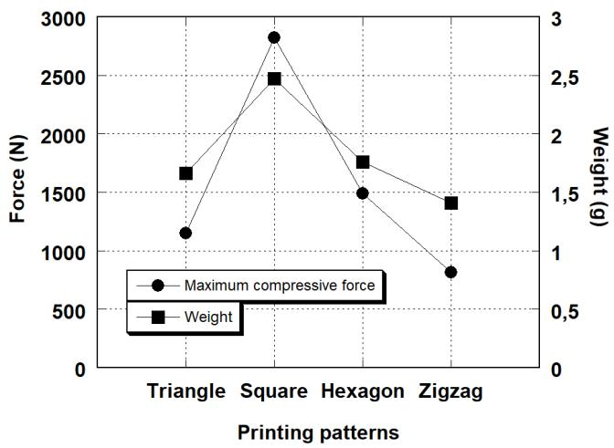  
Figure 6. Maximum compressive force and weight of ABS samples at  $15\%$  infill density

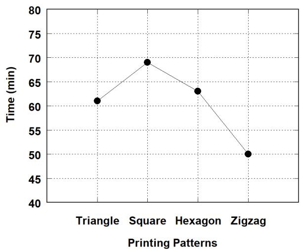  
Figure 7. Print time of ABS sample with  $15\%$  infill

The compressive strength and weight of the printed structures are shown in figure 6, and it indicates that compressive strength and weight of these structures increase correspondingly to each other. At  $15\%$  infill density, the square pattern structure is superior both in terms of maximum compressive strength at  $2824\mathrm{N}$  and material weight at  $2.47\mathrm{g}$ . The hexagonal pattern sample has a weight  $1.76\mathrm{g}$  and strength limit of  $1490\mathrm{N}$ , reducing the input material weight by  $28.7\%$  and the strength limit by  $47.2\%$  compared to the square pattern structure. Then the density of reduction in compressive strength and weight compared to square pattern of triangle and zigzag patterns are  $32.8\%$ ,  $59.2\%$  and  $42.9\%$ ,  $71.2\%$ , respectively. Thus, compressive strength of the printed patterns, having the same dimension, depends on their weight. This indicates that the density printed sample has effect on the compressive strength of 3D printed products, and higher density products which depend on their printed patterns have higher compressive strength.

The printing times of printed samples are described in figure 7. At  $15\%$  infill density, the results show that print time increases proportionally to printed sample weight. The square printed pattern has the longest printing time of 69 minutes; the next is hexagonal pattern with a time of 63 minutes. The triangle pattern takes 61 minutes to print completed and the zigzag pattern has the shortest printing time of 50 minutes.

# Conclusions

The influence of printing patterns and infill density on the 3D printed structure's strength was studied on three materials ABS, PLA and PLA-CF. The strength of printing patterns was evaluated by compression test and then the following conclusions were given.

- The printing patterns influence the strength of print structure, particularly the square pattern structures have the highest compressive forces with materials ABS, PLA and PLA-CF at  $2824\mathrm{N}$ ,  $2831\mathrm{N}$  and  $2697\mathrm{N}$ , respectively. Because square pattern structures have the highest weight and the heavier printed structures have higher compressive strengths at the same dimension and infill density.

- The increment of infill density increases the compressive strength of printed structures such as triangle pattern. Compressive force values increase more than 2.5 times and 4 times when printed at  $25\%$  (2788 N, 2632 N, 2875 N) and  $40\%$  (4434 N, 4014 N, 5011 N) infill density compared to their values printed at  $15\%$  infill density (1150 N, 873 N, 1282 N) with all materials ABS, PLA and PLA-CF.  
- The weight of printed samples having the same size is different, so the density of the printed sample depends on the printing pattern. When the printing pattern has higher density, it has better compressive strength.  
- Print time is longer when printed sample is heavier. It is taken 69 minutes to print square pattern sample which have  $2,47\mathrm{g}$  weight while the triangle pattern specimen, having  $1,41\mathrm{g}$  weight, takes 50 minutes.

# Acknowledgments

This research is funded by the Hanoi University of Science and Technology (HUST) under project number T2021-PC-032.

# References

[1]. Tuan D. Ngo, Alireza Kashani, Gabriele Imbalzano, Kate T. Q. Nguyen and David Hui. Additive manufacturing (3D printing): A review of materials, methods, applications and challenges. Composites Part B: Engineering Volume 143, 15 June 2018, Pages 172-196.  
[2]. Pavan Kumar Penumakala, JoseSanto, Alen Thomas. A critical review on the fused deposition modeling of thermoplastic polymer composites. Composites Part B: Engineering, Volume 201, 15 November 2020, 108336.  
[3]. Dhruv Maheshkumar Patel. Effects of infill patterns on time, surface roughness and tensile strength in 3D printing. International Journal of Engineering Development and Research 2017, Volume 5, 566-569.  
[4]. Gabriel A.J, Jesse J.F. Evaluation of Infill Effect on Mechanical Properties of Consumer 3D Printing Materials. Advances in Technology Innovation, vol. 3, no. 4, 2018, pp. 179 - 184.  
[5]. Cristian Dudescu and Laszlo Racz. Effects of Raster Orientation, Infill Rate and Infill Pattern on the Mechanical Properties of 3D Printed Materials. Acta Universitatis Cibiniensis - Technical Series, Volume 69 (2017): Issue 1 (December 2017).  
[6]. Chamil Abeykoon, Pimpisut Sri-Amphorn, AnuraFernando. Optimization of fused deposition modeling parameters for improved PLA and ABS 3D printed structures. International Journal of Lightweight Materials and Manufacture Volume 3, Issue 3, September 2020, Pages 284-297.  
[7]. Gordeev EG, Galushko AS, Ananikov VP. Improvement of quality of 3D printed objects by elimination of microscopic structural defects in fused deposition modeling. PLoS ONE (2018) 13(6): e0198370.  
[8]. Daniel Frank, Raymond L. Chandra, and Robert Schmitt. An Investigation of Cause-and-Effect Relationships Within a 3D-Printing System and the Applicability of Optimum Printing Parameters from Experimental Models to Different Printing Jobs. 3D printing and additive manufacturing, Volume 2, Number 3, 2015.  
[9]. Kovan V., Tezel T., Topal E.S., Camurlu H.E. Printing parameters effect on surface characteristics of 3d printedpla materials. International Scientific Journal Machines. Technologies. Materials. Vol. 12 (2018), Issue 7, pg(s) 266-269.

[10]. Nadir Ayrilmis. Effect of layer thickness on surface properties of 3D printed materials produced from wood flour/PLA filament Author links open overlay panel. Polymer Testing Volume 71, October 2018, Pages 163-166.  
[11]. Rafael Thiago Luiz Ferreira, Igor Cardoso Amatte, Thiago Assis Dutra, Daniel Burger. Experimental characterization and micrography of 3D printed PLA and PLA reinforced with short carbon fibers. Composites Part B: Engineering Volume 124, 1 September 2017, Pages 88-100.  
[12]. Calignano, F.; Lorusso, M.; Roppolo, I.; Minetola, P. Investigation of the Mechanical Properties of a Carbon Fibre-Reinforced Nylon Filament for 3D Printing. Machines 2020, 8, 52.  
[13]. Le, T.-H.; Le, V.-S.; Dang, Q.-K.; Nguyen, M.-T.; Le, T.-K.; Bui, N.-T. Microstructure Evaluation and Thermal-Mechanical Properties of ABS Matrix Composite Filament Reinforced with Multi-Walled Carbon Nanotubes by a Single Screw Extruder for FDM 3D Printing. Appl. Sci. 2021, 11, 8798  
[14]. Xianhui Zhao, Halil Tekinalp, Xianzhi Meng, Darby Ker, Bowie Benson, Yunqiao Pu, Arthur Ragauskas, Yu Wang, Kai Li, Erin Webb, Douglas J. Gardner, James Anderson, and Soydan Ozcan. Poplar as biofiber reinforcement in composites for large-scale 3D printing. ACS Appl. Bio Mater. 2019, 2, 10, 4557-4570.  
[15]. Raymond K.F. Lam, Michael Orozco, Erick Mendieta, Bernard Hunter, and Joseph Seiter. Compressive Mechanical Properties of Three-Dimensional (3D) Printed Thermoplastics.  
[16]. Nur Ameelia Rosli, Rafidah Hasan, Mohd Rizal Alkahari. Effect of default parameters on properties of FDM printed cubes. Proceedings of Mechanical Engineering Research Day 2018, pp. 230-232, May 2018.  
[17]. Balakrishnan Subeshan, Abdullah Alonayni, Muhammad M. Rahman, and Eylem Asmatulu, Proc. of SPIE Vol. 10597 105970N-2, DOI: 10.1117/12.2296651  
[18]. Susan Erica Nace, John Tiernan, Donal Holland, Aisling Ni Annaidh, A comparative analysis of the compression characteristics of a thermoplastic polyurethane 3D printed in four infill patterns for comfort applications, Rapid Prototyping Journal, Volume 27 Number 11, 2021, 24-36.